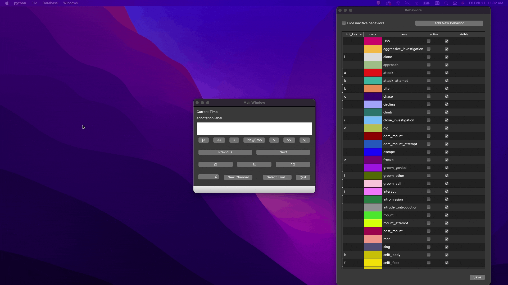

# Tutorial
This tutorial will walk you through the entire process of setting up Bento and working with data. Follow this tutorial using our sample dataset, then get started with your own data.

> ANN: once I've written this part, each ## header should be split into its own separate file within the tutorial folder, and the text below replaced with a hyperlinked table of contents.

## Initializing Bento
These steps will need to be followed the first time you run Bento.

### Before you begin
Bento constructs a database that keeps track of your data files. You can choose to manage data in two ways: in a local, private database or via a shared database.

- **Private** database hosting allows you to quickly install and start using Bento without installing additional software, however the built database cannot be easily shared by multiple users within a lab.
- **Shared** database hosting allows you to create a common lab-wide database to manage your group's experimental data. This configuration requires some additional effort to set up hosting on a server or network-attached storage device.

### Setting up a private database

### Setting up a shared database

## Preparing the database
Before you can start adding actual experiments, you'll need to provide a little background information for the database.

### Adding investigators

1. Click on **Database** in the menu bar and then click on **Investigator...** option. **Investigator Dialog** will pop up.
2. Select **New Investigator** in the **Investigator** field.
3. Type relevant information in all the fields and hit **Apply** button.
4. After hitting **Apply** button, you can see an investigator information popping up when you select the added investigator.
5. You can add multiple investigators based on your requirement. Repeat steps 1-4, every time you need to add a new investigator.

### Adding animals

1. Click on **Database** in the menu bar and then click on **Animal...** option. **Animal Dialog** will pop up.
2. Select relevant investigator in the **Investigator** field.
3. In the **Animal** table, click on the first row which says **New Animal**.
4. Add information such as **Animal Services ID**, **Nickname**, **Date of Birth**, **Sex** and **Genotype**.
5. Click on **Apply** button and you will see new animal in the **Animal** table.
6. You can add multiple animals based on your requirement. Repeat steps 1-5, every time you need to add a new animal.

#### Tracking animal surgeries

1. In the **Animal Dialog**, you can see section called **Surgical Log** at the bottom. You can add surgical logs for each animal added. 
2. Select an added animal in the **Animal** table.
3. Click on **Add ...** button located in the **Surgical log** section. **Add Surgery Dialog** will pop up.
4. Add all the information in the dialog and click on **OK** button.
5. Repeat steps 1-4, every time you need to add a new surgical log.

### Adding camera profiles

1. Click on **Database** in the menu bar and then click on **Camera...** options. **Camera Dialog** will pop up.
2. Select **New Camera** in the **Camera** field.
3. Type relevant information in the all the fields and hit **Apply** button.
4. After hitting **Apply** button, you can see camera information popping up when you select the added camera.
5. You can add multiple cameras based on your requirement. Repeat steps 1-4, every time you need to add a new camera.

## Populating the database
Now that you have experimenters, animals, and cameras on record, you can start using Bento to organize your experimental data.

### Adding a Session

1. Click on **Select Trial...** button on the main window. **Trial Selection Window** will pop up.
2. Select an investigator by clicking on the drop down menu at the top.
3. Click on **Add New Session...** button. **Add or Edit Session Dialog** will pop up.
4. Select an animal in the **Animal** table by selecting a row corresponding to that animal.
5. Select a base directory where your data is located by clicking on **Select...** button corresponding to **Base Directory** field.
6. Click **OK** button. You will see a session added in the **Session** table.
7. You can add sessions for all the animals. Repeat steps 1-6, every time you need to add a new session.

### Adding and populating a Trial

1. Click on **Select Trial...** button on the main window. **Trial Selection Window** will pop up.
2. Select an investigator by clicking on the drop down menu at the top.
3. Select a session in the **Select Session** table by clicking the corresponding row.
4. Click on **Add New Trial...** button. **Add or Edit Trial dialog** will pop up.
5. Add Stimulus in the **Stimulus** field.
6. You can add **Video files**, **Annotation files** and **Neural Files** in the window. **Pose files** and **Audio files** are not yet supported.
7. Click **OK** button. You will see a trial added in the **Trial** table along with files you selected for the trial.
8. You can add multiple trials under the same session. Repeat steps 1-7, every time you need to add a trial under a particular session.

### Syncing up multiple data files

## Loading data from a trial

> Note : Assuming you have already added a session and trial.

1. Click on **Select Trial...** button on the main window. **Trial Selection Window** will pop up.
2. Select an investigator by clicking on the drop down menu at the top.
3. Select a session in the **Select Session** table by clicking the corresponding row. Selecting a session will pop up trials in that session.
4. Select a trial in the **Select Trial** table by clicking the corresponding row. 
5. Click **Open** button. You will see multiple windows pop up based on the number of files in your trials.
6. Repeat steps 1-5, every time you need to load a new trial.

## Annotating a trial

### Creating a new annotation channel

> Note : Assuming you are a loading a trial with no annotation file in it. You can also load a trial with an exisiing annotation file and do all the steps. 

1. Load a trial as mentioned in [Loading data from a trial](https://github.com/neuroethology/bento/blob/feature/documentation/documentation/tutorial.md#Loading-data-from-a-trial).
2. In the **Main Window**, click on **New Channel** button. **New Channel Dialog** will pop up.
3. Add any relevant channel name in the **Channel Name** text box and click **OK** button.
4. You will see a channel added in the drop down box left to the **New Channel** button.
5. You can add multiple channels for the same trial. Repeat steps 1-4, every time you need to add a channel.

### Creating a new behavior

1. In the **Behaviors** window, click on **Add New Behavior** button. There will be a new row added in the table with a name **New_Behavior**.
2. Double click on the name and edit the name by giving a relevant name to a behavior.
3. You can keep the **active** checkbox ticked if you are gonna use that behavior for annotation.
4. Provide a **unique** character key in the **hot_key** cell if you are gonna use that behavior for annotation.
5. Double click on **color** cell and **Colors** dialog will pop up. Set a color of your choice for the behavior.
6. Click **Save** button so that this added new behavior will pop up every time you launch Bento.
7. You can add multiple behaviors. Repeat steps 1-6, every time you need to add a new behavior.

### Editing behavior properties

1. In the **Behaviors** window, you can edit **hot_key**, **color**, **name** and **active** fields. Details about **visible** field is in section **Adding Annotations**.
2. To edit **hot_key**, double click on the cell and edit the character key. Make sure to provide **unique** character keys to different behaviors.
3. To edit **color**, double click on the cell and **Colors** dialog will pop up. Set a color of your choice.
4. To edit **name**, double click on the cell and change the name based on your requirement.
5. Tick checkbox **active** if you want use that behavior in the annotations.
6. Click **Save** button after making all the edits.

### Adding annotations

> Note : Assuming you are a loading a trial with no annotation file in it. You can also load a trial with an exisiing annotation file and do all the steps. 

1. Add a channel as mentioned in [Creating a new annotation channel](https://github.com/neuroethology/bento/blob/feature/documentation/documentation/tutorial.md#Creating-a-new-annotation-channel)
2. [Create new behaviors](https://github.com/neuroethology/bento/blob/feature/documentation/documentation/tutorial.md#Creating-a-new-behavior) or [edit behavior properties](https://github.com/neuroethology/bento/blob/feature/documentation/documentation/tutorial.md#Editing-behavior-properties) based on your requirement for adding annotations.

### Deleting annotations

### Saving annotations
